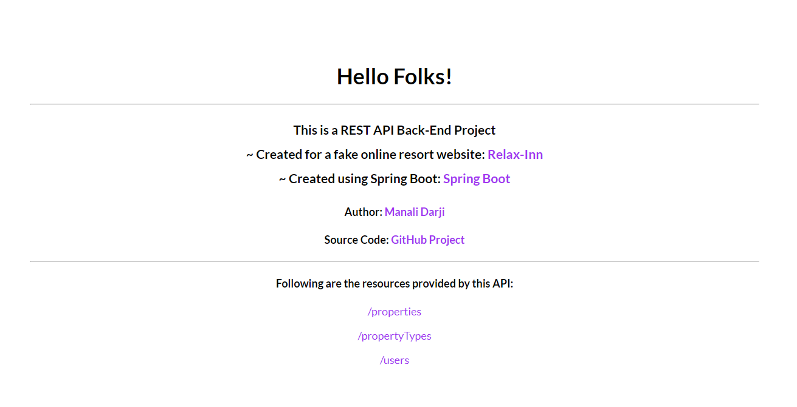

# RESTful API Project

- A RESTful API made using [Java Spring Boot Framework](https://spring.io/projects/spring-boot).
- This API was built for a fake vacation rentals website; [Relax-Inn](https://relax-inn-by-manali.netlify.app/)
- *Please Note:* This project is deployed on Heroku, hence it might take a minute to load.

## API
#### API Endpoint: [https://relax-inn-api-spring-boot.herokuapp.com/](https://relax-inn-api-spring-boot.herokuapp.com/)

**_PROPERTIES_**

#### /properties
* `GET` : Get all properties
* `POST` : Create a new property

#### /projects/:propID
* `GET` : Get a property
* `PUT` : Update a property
* `DELETE` : Delete a property

#### /properties/type/:propType
* `GET` : Get all properties of a specific type

#### /properties/search?searchTerm=searchKW
* `GET` : Get all properties containing searchKW in their title(case insensitive)

#### /properties/bestseller
* `GET` : Get all bestseller properties

#### /properties/bestseller?limit=3
* `GET` : Get 3 bestseller properties

---
**_PROPERTY TYPES_**

#### /propertyTypes
* `GET` : Get all property types
* `POST` : Create a new property type

#### /propertyTypes?limit=3
* `GET` : Get 3 property types
---
**_USERS_**

#### /users
* `GET` : Get all users
* `POST` : Create a new user

#### /users/:userID
* `GET` : Get specific user

#### /register
* `POST` : Create a new user

#### /auth
* `POST` : Authenticate a user

## Screenshot
Home Page showing resources provided by this API

## Author
[Manali Darji](https://www.linkedin.com/in/manalidarji/)
